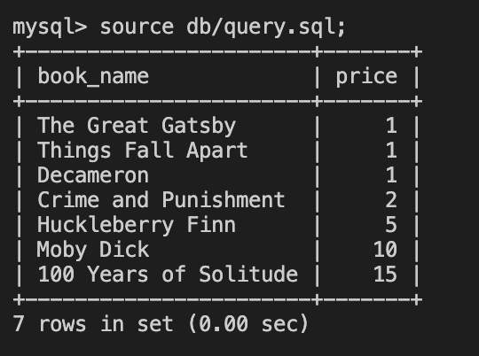

# 🏗️ Convert Database from 1NF to 3NF

Work with a partner to implement the following user story:

* As a developer, I want to normalize a database currently in 1NF to 3NF to improve efficiency, reduce redundancy, and ensure data integrity.

## Acceptance Criteria

* It's done when a database table in 1NF is successfully decomposed into multiple tables eliminating repeating groups, ensuring every attribute is functionally dependent on the primary key and removing transitive dependencies.

* It's done when relationships between the tables have been established using foreign keys.

* It's done when we can retrieve the same set of information from the 3NF tables as the original 1NF table using JOIN clauses.

## Assets

The following image demonstrates the expected result after converting to 3NF:

---

## 💡 Hints

* Remember the steps to convert from 1NF to 2NF and then to 3NF. Focus on identifying and eliminating any repeating groups, ensuring attributes are functionally dependent on the primary key, and removing columns not dependent on the primary key.

## 🏆 Bonus

If you have completed this activity, work through the following challenge with your partner to further your knowledge:

* How would you handle situations where attributes in a table depend on multiple attributes (composite key)? How does this affect normalization?
  
Use [Google](https://www.google.com) or another search engine to research this.

---

© 2024 edX Boot Camps LLC. Confidential and Proprietary. All Rights Reserved.
